# Super LED Panel - Strategie Projet

> **Panneau LED programmable open-source style iPixel Colors**
> Projet initie le 2025-11-29

---

## Vision du Projet

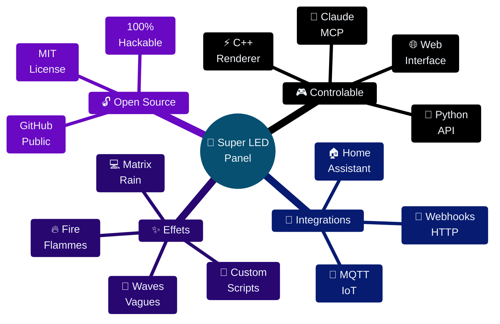

### Objectif

Creer un panneau LED RGB programmable **100% open-source**, controlable via:

| Stack | Role | Langages |
|:------|:-----|:---------|
| **Renderer** | Rendu bas niveau, effets, animations | `C++` |
| **Backend** | API, webhooks, MCP integration | `Python` |
| **Frontend** | Dashboard, controle a distance | `HTML/JS` |

> **Inspiration**: Panneaux iPixel Colors mais entierement hackable et integrable dans des SaaS.

---

## Architecture Technique

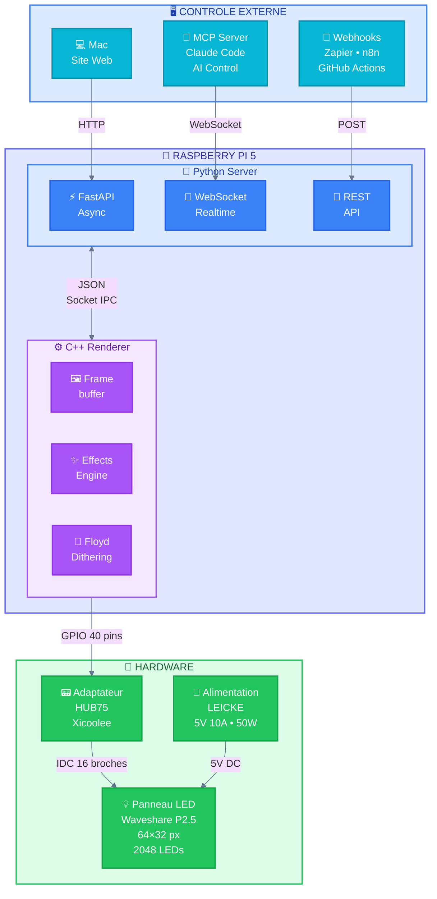

### Stack Logiciel

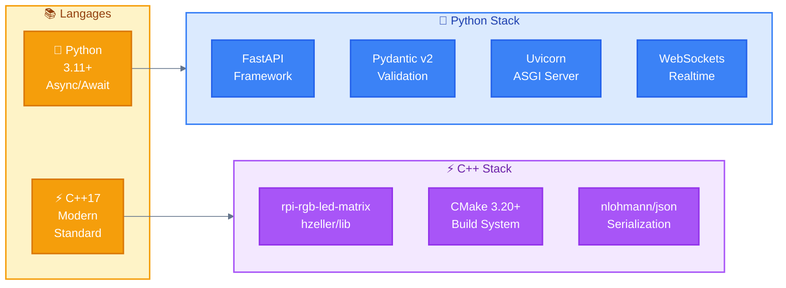

---

## Liste d'Achats Validee

### Composants Essentiels

| # | Produit | Image | Prix | Status |
|:-:|:--------|:-----:|-----:|:------:|
| 1 | **Kit Raspberry Pi 5 8GB**<br/>Boitier metal • NVMe • 27W • SD 64GB<br/>[B0CRMQCYXH](https://www.amazon.fr/dp/B0CRMQCYXH) |  | **158,90€** | ✅ |
| 2 | **Panneau Waveshare P2.5 64×32**<br/>2048 LEDs • Cable IDC inclus<br/>[B0BQYDLHY9](https://www.amazon.fr/dp/B0BQYDLHY9) |  | **29,99€** | ✅ |
| 3 | **Adaptateur HUB75 Xicoolee**<br/>GPIO→HUB75 • Compatible Pi 5<br/>[B0BC8Y447G](https://www.amazon.fr/dp/B0BC8Y447G) |  | **19,90€** | ✅ |
| 4 | **Alimentation LEICKE 5V 10A**<br/>50W • Pour panneau LED<br/>[B07YVBHH6K](https://www.amazon.fr/dp/B07YVBHH6K) |  | **29,99€** | ✅ |

### Composants Optionnels (Recommandes)

| # | Produit | Image | Prix | Verdict |
|:-:|:--------|:-----:|-----:|:--------|
| 5 | **Kit Freenove 132 projets**<br/>860 pages • Python/C/Java<br/>[B092V1BPBC](https://www.amazon.fr/dp/B092V1BPBC) |  | **64,95€** | ✅ Meme stack! |
| 6 | **Ecran LCD I2C 16×2**<br/>Debug • Status<br/>[B0B76YGDV4](https://www.amazon.fr/dp/B0B76YGDV4) |  | **8,95€** | 🤔 Optionnel |

---

### Kit Freenove - Synergie avec le Projet

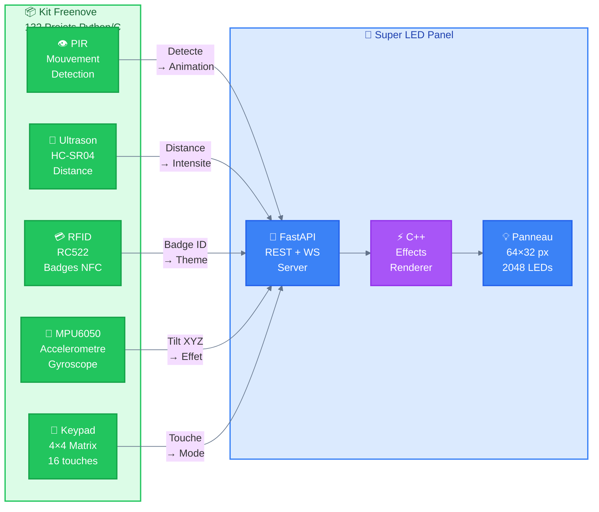

| Capteur Freenove | Integration LED Panel |
|:-----------------|:----------------------|
| 👁️ PIR Motion | Declencheur d'animation automatique |
| 📏 Ultrason | Effet selon distance (proche = intense) |
| 💳 RFID | Animation personnalisee par badge |
| 📐 Accelerometre | Effet qui suit l'inclinaison |
| 🔢 Keypad | Selection manuelle des effets |

---

### A NE PAS ACHETER ❌

| Produit | ASIN | Raison |
|:--------|:-----|:-------|
| ~~Boitier ElectroCookie~~ | B0CV7GN22G | **DOUBLON** - Kit Pi5 inclut boitier metal |
| ~~Blocs 5V 2A~~ | B0F485M8SG | **INSUFFISANT** - 2A < 2.5A requis |

---

### Recapitulatif Budget

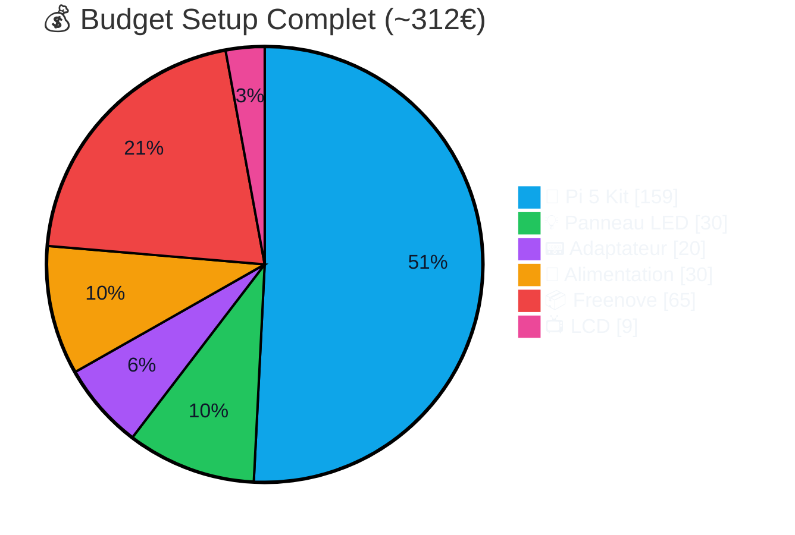

| Configuration | Composants | Prix |
|:--------------|:-----------|-----:|
| **Setup Minimal** | Pi5 + Panel + HUB75 + PSU | **239€** |
| **Setup Complet** | + Freenove + LCD | **312€** |

> **Recommandation**: Le **Setup Complet** est ideal car Freenove utilise le meme stack Python/C et permet d'enrichir le projet avec des capteurs.

---

## Specifications Techniques

### Panneau Waveshare RGB-Matrix-P2.5-64x32

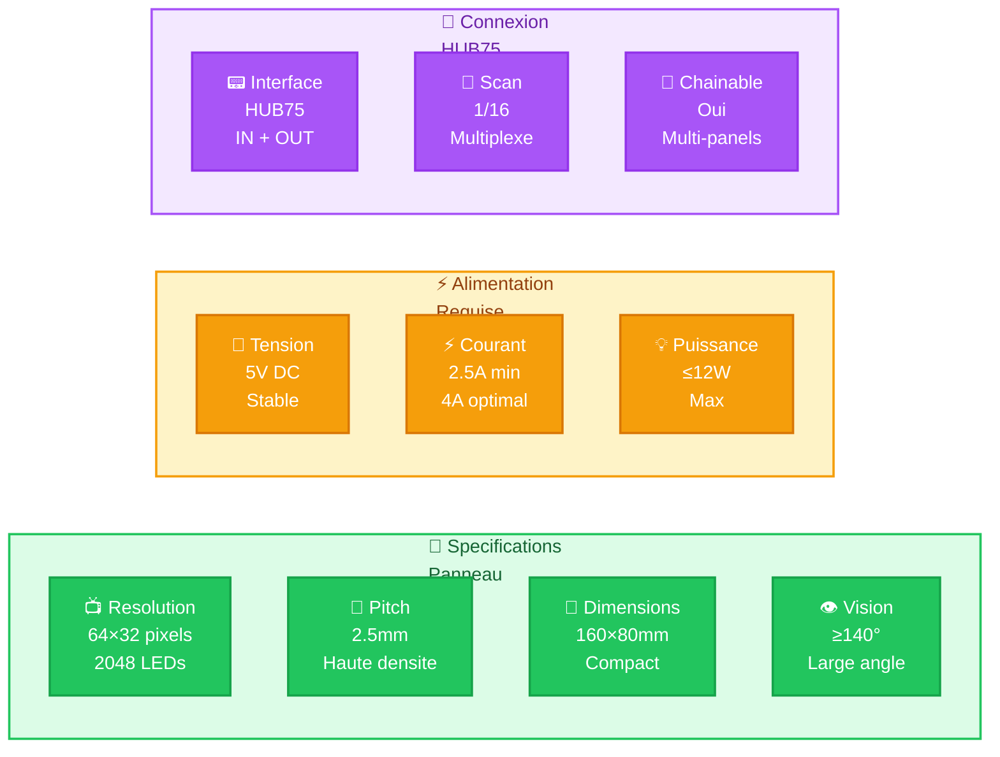

| Spec | Valeur |
|:-----|:-------|
| Resolution | 64×32 = **2048 pixels** |
| Pitch | 2.5mm |
| Dimensions | 160mm × 80mm |
| Angle de vision | ≥140° |
| Type de scan | 1/16 scan |
| Interface | HUB75 (IN + OUT chainable) |
| Alimentation | **5V / 2.5A min** (4A recommande) |
| Puissance | ≤12W |
| Contenu | Panneau + Adaptateur + Cable IDC 16P |

### Raspberry Pi 5 (Kit B0CRMQCYXH)

| Spec | Valeur |
|:-----|:-------|
| CPU | Quad-core ARM Cortex-A76 @ **2.4GHz** |
| RAM | **8GB** LPDDR4X |
| Stockage | microSD 64GB + NVMe PCIe |
| Alimentation | USB-C 27W incluse |
| Connectivite | WiFi • Bluetooth • Gigabit |
| GPIO | 40 pins |

### Adaptateur HUB75 Xicoolee

| Spec | Valeur |
|:-----|:-------|
| Compatibilite | Tous Raspberry Pi + Pico |
| Entree alim | USB-C 5V/4A **ou** DC 5V/8A |
| Sortie | HUB75 + Borniers VH-4P |
| Inclus | Cables • Visserie • Entretoises |

---

## Workflow de Montage

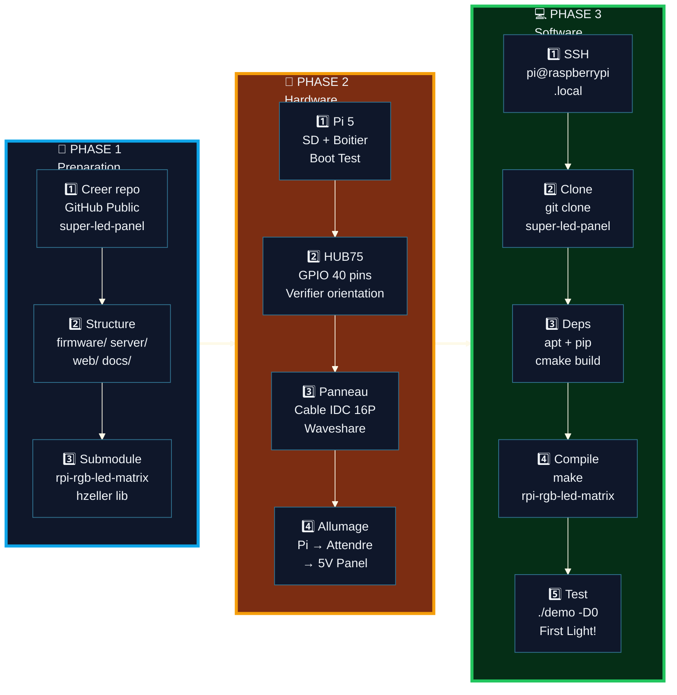

### Phase 1: Preparation (Avant reception)

```bash
# Creer le repo GitHub
git init super-led-panel
cd super-led-panel

# Structure du projet
mkdir -p firmware/{include,src,third_party}
mkdir -p server/{app,scripts}
mkdir -p web docs

# Ajouter la lib LED comme submodule
git submodule add \
  https://github.com/hzeller/rpi-rgb-led-matrix \
  firmware/third_party/rpi-rgb-led-matrix
```

### Phase 2: Montage Hardware

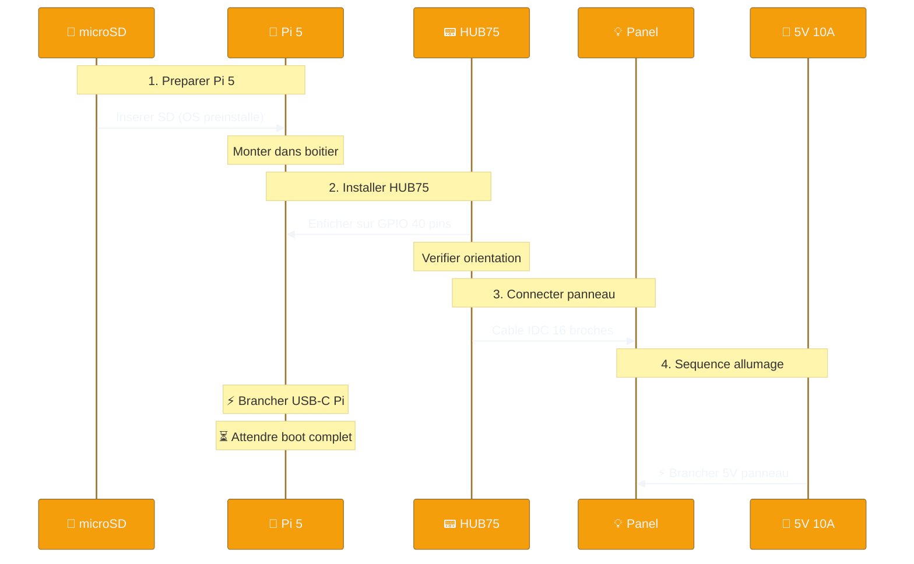

### Phase 3: Installation Software

```bash
# Sur le Raspberry Pi (via SSH)
ssh pi@raspberrypi.local

# Cloner le repo
git clone https://github.com/ThibautMelen/super-led-panel.git
cd super-led-panel

# Installer dependances
sudo apt update
sudo apt install -y build-essential cmake python3-pip python3-venv

# Compiler la lib LED
cd firmware/third_party/rpi-rgb-led-matrix
make

# Tester avec un exemple
cd examples-api-use
make
sudo ./demo -D0 --led-no-hardware-pulse --led-cols=64 --led-rows=32
```

---

## Structure du Repository

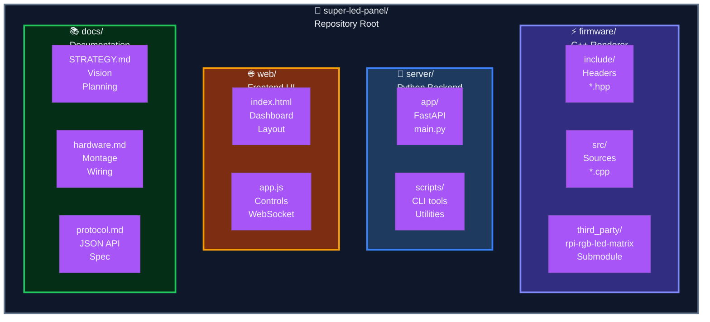

```
super-led-panel/
├── firmware/                    # ⚡ C++ - Moteur de rendu
│   ├── include/
│   │   ├── framebuffer.hpp
│   │   ├── effects.hpp
│   │   ├── protocol.hpp
│   │   └── renderer.hpp
│   ├── src/
│   │   ├── main.cpp
│   │   ├── effects_fire.cpp
│   │   ├── effects_waves.cpp
│   │   └── effects_matrix.cpp
│   └── third_party/
│       └── rpi-rgb-led-matrix/
│
├── server/                      # 🐍 Python - API
│   ├── app/
│   │   ├── main.py              # FastAPI app
│   │   ├── api.py               # REST endpoints
│   │   ├── websocket.py         # WS handler
│   │   └── models.py            # Pydantic
│   └── requirements.txt
│
├── web/                         # 🌐 Frontend
│   ├── index.html
│   └── app.js
│
└── docs/                        # 📚 Documentation
    └── STRATEGY.md
```

---

## Protocole de Communication

### Format JSON (Python → C++)

```json
{
  "type": "text|image|effect|raw",
  "payload": {
    "text": "Hello World",
    "color": [255, 0, 0],
    "x": 0,
    "y": 0,
    "scroll": true,
    "speed": 50
  }
}
```

### Endpoints API

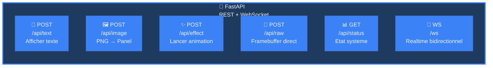

| Methode | Endpoint | Description |
|:--------|:---------|:------------|
| `POST` | `/api/text` | Afficher du texte |
| `POST` | `/api/image` | Afficher une image |
| `POST` | `/api/effect` | Lancer un effet |
| `POST` | `/api/raw` | Envoyer framebuffer |
| `GET` | `/api/status` | Etat du panneau |
| `WS` | `/ws` | WebSocket temps reel |

---

## Effets a Implementer

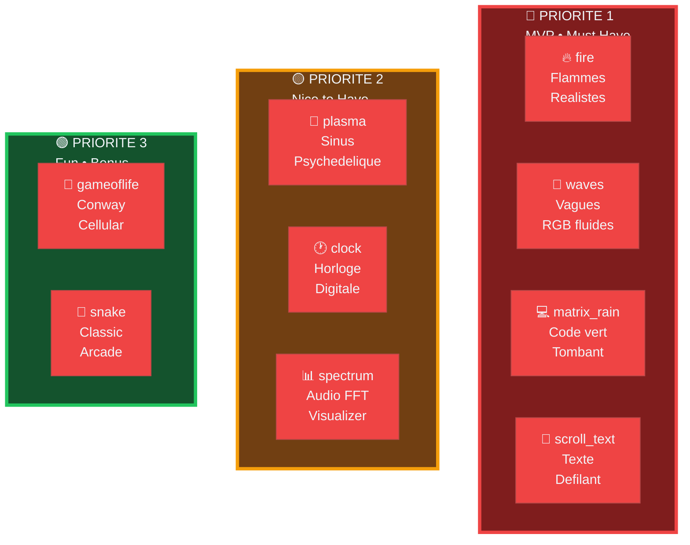

| Effet | Priorite | Description |
|:------|:--------:|:------------|
| `fire` | 🔴 P1 | Flammes animees realistes |
| `waves` | 🔴 P1 | Vagues de couleurs fluides |
| `matrix_rain` | 🔴 P1 | Code Matrix tombant |
| `scroll_text` | 🔴 P1 | Texte defilant horizontal |
| `plasma` | 🟡 P2 | Effet plasma psychedelique |
| `clock` | 🟡 P2 | Horloge numerique |
| `spectrum` | 🟡 P2 | Visualiseur audio |
| `gameoflife` | 🟢 P3 | Jeu de la vie Conway |
| `snake` | 🟢 P3 | Jeu Snake classique |

---

## Integrations Futures

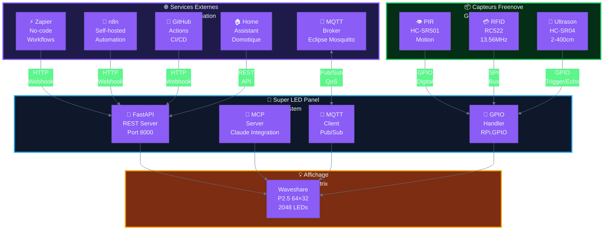

| Integration | Protocol | Use Case |
|:------------|:---------|:---------|
| **Webhooks** | HTTP POST | Notifications Zapier, n8n, GitHub |
| **MCP Server** | WebSocket | Controle via Claude Code |
| **Home Assistant** | REST API | Automatisation domotique |
| **MQTT** | Pub/Sub | Messages IoT temps reel |
| **Freenove GPIO** | GPIO/SPI | Capteurs physiques |

---

## Checklist Pre-Commande

### ✅ Panier Valide (333,60€)

- [x] 🍓 Kit Raspberry Pi 5 8GB (B0CRMQCYXH) — **158,90€**
- [x] 💡 Panneau Waveshare P2.5 64×32 (B0BQYDLHY9) — **29,99€**
- [x] 📟 Adaptateur HUB75 Xicoolee (B0BC8Y447G) — **19,90€**
- [x] 🔋 Alimentation LEICKE 5V 10A (B07YVBHH6K) — **29,99€**
- [x] 📦 Kit Freenove 132 projets (B092V1BPBC) — **64,95€**
- [x] 📺 Ecran LCD I2C 16×2 (B0B76YGDV4) — **8,95€**
- [ ] 📖 Livre "The Creative Act" — 20,92€ *(optionnel)*

### ❌ Retires du Panier

- [x] ~~Boitier ElectroCookie~~ — DOUBLON
- [x] ~~Blocs 5V 2A~~ — INSUFFISANT

---

## Ressources

| Type | Lien |
|:-----|:-----|
| 📚 Lib LED | [rpi-rgb-led-matrix](https://github.com/hzeller/rpi-rgb-led-matrix) |
| 📖 Wiki Waveshare | [RGB-Matrix-P2.5-64x32](https://www.waveshare.com/wiki/RGB-Matrix-P2.5-64x32) |
| 🍓 PioMatter Pi5 | [Adafruit Blinka](https://github.com/adafruit/Adafruit_Blinka_Raspberry_Pi5_Piomatter) |
| 🐍 FastAPI | [Documentation](https://fastapi.tiangolo.com/) |
| 📦 Freenove | [GitHub](https://github.com/Freenove/Freenove_Projects_Kit_for_Raspberry_Pi) |

---

> *Document genere le 2025-11-29 par Claude Code*
> *Theme: Solarized Dark + Tailwind CSS Colors*
