# Super Pixeled - Repository Setup Implementation Plan

> **For Claude:** REQUIRED SUB-SKILL: Use superpowers:executing-plans to implement this plan task-by-task.

**Goal:** Initialize the super-pixeled repository with Johnny Decimal structure, CLAUDE.md, README.md, pre-commit hooks, CI/CD, and push to GitHub.

**Architecture:** Johnny Decimal folder structure (00-docs, 10-firmware, 20-server, 30-mcp, 40-web) with TDD-ready configuration, pre-commit hooks for Python (ruff) and C++ (clang-format), GitHub Actions CI.

**Tech Stack:** Git, GitHub CLI, Python 3.11+ (uv), C++17 (CMake), pre-commit, ruff, clang-format, pytest, GoogleTest

---

## Phase 1: Repository Initialization

### Task 1: Rename and Clean Project Directory

**Files:**
- Rename: `/Users/thibaut/Documents/super-led-panel` → `/Users/thibaut/Documents/super-pixeled`
- Delete: Old placeholder READMEs

**Step 1: Rename project directory**

```bash
cd /Users/thibaut/Documents
mv super-led-panel super-pixeled
cd super-pixeled
```

**Step 2: Remove old placeholder files**

```bash
rm -rf firmware server web docs
rm -f .DS_Store
```

**Step 3: Verify clean state**

```bash
ls -la
```

Expected: Empty directory (or just hidden files)

---

### Task 2: Create Johnny Decimal Structure

**Files:**
- Create: `00-docs/`
- Create: `10-firmware/`
- Create: `20-server/`
- Create: `30-mcp/`
- Create: `40-web/`

**Step 1: Create all directories**

```bash
mkdir -p 00-docs/{plans,hardware,api}
mkdir -p 10-firmware/{include,src,tests,third_party}
mkdir -p 20-server/{app,tests}
mkdir -p 30-mcp/{src,tests}
mkdir -p 40-web/{src,tests}
```

**Step 2: Verify structure**

```bash
find . -type d | head -20
```

Expected:
```
.
./00-docs
./00-docs/plans
./00-docs/hardware
./00-docs/api
./10-firmware
./10-firmware/include
./10-firmware/src
./10-firmware/tests
./10-firmware/third_party
./20-server
./20-server/app
./20-server/tests
./30-mcp
./30-mcp/src
./30-mcp/tests
./40-web
./40-web/src
./40-web/tests
```

---

### Task 3: Initialize Git Repository

**Files:**
- Create: `.git/`
- Create: `.gitignore`

**Step 1: Initialize git**

```bash
git init
```

**Step 2: Create .gitignore**

```gitignore
# Python
__pycache__/
*.py[cod]
*$py.class
.venv/
.uv/
*.egg-info/
dist/
build/
.coverage
htmlcov/
.pytest_cache/
.ruff_cache/

# C++
build/
*.o
*.a
*.so
*.dylib
CMakeFiles/
CMakeCache.txt
cmake_install.cmake
Makefile

# IDE
.vscode/
.idea/
*.swp
*.swo
*~

# OS
.DS_Store
Thumbs.db

# Env
.env
.env.local
*.log
```

**Step 3: Verify git status**

```bash
git status
```

Expected: Untracked files shown

---

## Phase 2: Core Documentation

### Task 4: Create LICENSE (MIT)

**Files:**
- Create: `LICENSE`

**Step 1: Write LICENSE file**

```text
MIT License

Copyright (c) 2025 Thibaut Melen

Permission is hereby granted, free of charge, to any person obtaining a copy
of this software and associated documentation files (the "Software"), to deal
in the Software without restriction, including without limitation the rights
to use, copy, modify, merge, publish, distribute, sublicense, and/or sell
copies of the Software, and to permit persons to whom the Software is
furnished to do so, subject to the following conditions:

The above copyright notice and this permission notice shall be included in all
copies or substantial portions of the Software.

THE SOFTWARE IS PROVIDED "AS IS", WITHOUT WARRANTY OF ANY KIND, EXPRESS OR
IMPLIED, INCLUDING BUT NOT LIMITED TO THE WARRANTIES OF MERCHANTABILITY,
FITNESS FOR A PARTICULAR PURPOSE AND NONINFRINGEMENT. IN NO EVENT SHALL THE
AUTHORS OR COPYRIGHT HOLDERS BE LIABLE FOR ANY CLAIM, DAMAGES OR OTHER
LIABILITY, WHETHER IN AN ACTION OF CONTRACT, TORT OR OTHERWISE, ARISING FROM,
OUT OF OR IN CONNECTION WITH THE SOFTWARE OR THE USE OR OTHER DEALINGS IN THE
SOFTWARE.
```

**Step 2: Verify file exists**

```bash
cat LICENSE | head -3
```

Expected: "MIT License" header

---

### Task 5: Create CLAUDE.md

**Files:**
- Create: `CLAUDE.md`

**Step 1: Write CLAUDE.md**

```markdown
# Super Pixeled

> Panneau LED RGB programmable open-source

---

## 🎯 Projet

| Aspect | Valeur |
|:-------|:-------|
| **Stack** | C++17 (renderer) • Python 3.11+ (API) • TypeScript (web) |
| **Hardware** | Raspberry Pi 5 • Waveshare P2.5 64×32 • HUB75 |
| **Architecture** | Johnny Decimal (`00-docs/`, `10-firmware/`, etc.) |

---

## 📁 Structure

```
00-docs/     → Documentation, plans, specs
10-firmware/ → C++ renderer (rpi-rgb-led-matrix)
20-server/   → Python FastAPI backend
30-mcp/      → Claude MCP Server integration
40-web/      → Frontend dashboard
```

---

## 🔴 Règles Critiques

1. **TDD obligatoire** — Test AVANT implémentation
2. **80% coverage minimum** — pytest (Python), GoogleTest (C++)
3. **Pre-commit DOIT passer** — ruff, clang-format, tests
4. **Jamais de push sans CI verte**

---

## 💻 Commandes

```bash
# Python (20-server/)
uv run pytest                    # Tests
uv run pytest --cov --cov-report=term-missing  # Coverage
uv run ruff check .              # Lint
uv run ruff format .             # Format

# C++ (10-firmware/)
cmake -B build && cmake --build build  # Build
ctest --test-dir build           # Tests
clang-format -i src/*.cpp        # Format

# Pre-commit (root)
pre-commit run --all-files       # Tous les hooks
```

---

## 📝 Conventions

| Type | Convention |
|:-----|:-----------|
| **Commits** | `type(scope): description` — Conventional Commits |
| **Branches** | `feature/xxx`, `fix/xxx`, `docs/xxx` |
| **Python** | PEP 8, ruff, type hints obligatoires |
| **C++** | Google Style, clang-format |
| **Nommage** | `snake_case` (Python/C++), `camelCase` (JS/TS) |

---

## 🚫 Ne Pas Faire

- Skip les tests "pour aller plus vite"
- Commit sans pre-commit
- Modifier `10-firmware/third_party/` (submodule)
- Push sur `main` directement (PR obligatoire)
```

**Step 2: Verify file**

```bash
head -10 CLAUDE.md
```

Expected: Title and tagline visible

---

### Task 6: Create README.md

**Files:**
- Create: `README.md`

**Step 1: Write README.md with Mermaid**

```markdown
# 🎮 Super Pixeled

> Panneau LED RGB programmable 100% open-source et hackable

[](https://github.com/ThibautMelen/super-pixeled/actions)
[](LICENSE)
[](https://www.python.org/)
[](https://isocpp.org/)

---

## ✨ Features

- 🔥 **Effets temps réel** — Fire, Matrix, Waves, Plasma
- 🐍 **API REST + WebSocket** — FastAPI async
- ⚡ **Renderer C++ haute perf** — 60 FPS, Floyd dithering
- 🤖 **MCP Server** — Contrôle via Claude Code
- 🏠 **Intégrations** — Home Assistant, MQTT, Webhooks

---

## 🏗️ Architecture

```mermaid
flowchart LR
    subgraph CONTROL["🖥️ Contrôle"]
        WEB["🌐 Web UI"]
        MCP["🤖 Claude MCP"]
        API["📨 Webhooks"]
    end

    subgraph PI["🍓 Raspberry Pi 5"]
        FASTAPI["🐍 FastAPI"]
        CPP["⚡ C++ Renderer"]
        FASTAPI <-->|IPC| CPP
    end

    subgraph HW["🔌 Hardware"]
        LED["💡 Panel 64×32"]
    end

    CONTROL --> FASTAPI
    CPP --> LED
```



---

## 📁 Structure

```
super-pixeled/
├── 00-docs/        # 📚 Documentation
├── 10-firmware/    # ⚡ C++ Renderer
├── 20-server/      # 🐍 Python API
├── 30-mcp/         # 🤖 MCP Server
└── 40-web/         # 🌐 Dashboard
```

---

## 🚀 Quick Start

### Prérequis

- Raspberry Pi 5 (8GB recommandé)
- Panneau LED HUB75 (Waveshare P2.5 64×32)
- Python 3.11+ & CMake 3.20+

### Installation

```bash
# Clone
git clone --recursive https://github.com/ThibautMelen/super-pixeled.git
cd super-pixeled

# C++ Renderer
cd 10-firmware
cmake -B build && cmake --build build

# Python Server
cd ../20-server
uv sync
uv run uvicorn app.main:app --host 0.0.0.0

# Web UI
open http://raspberrypi.local:8000
```

---

## 🧪 Tests

```bash
# Python
cd 20-server && uv run pytest --cov

# C++
cd 10-firmware && ctest --test-dir build

# Tous les hooks
pre-commit run --all-files
```

---

## 🎨 Effets Disponibles

| Effet | Description | Priorité |
|:------|:------------|:--------:|
| `fire` | Flammes réalistes | 🔴 P1 |
| `matrix` | Code tombant | 🔴 P1 |
| `waves` | Vagues RGB | 🔴 P1 |
| `plasma` | Sinus psychédélique | 🟡 P2 |
| `clock` | Horloge digitale | 🟡 P2 |

---

## 📡 API

```bash
# Afficher du texte
curl -X POST http://pi:8000/api/text \
  -H "Content-Type: application/json" \
  -d '{"text": "Hello!", "color": [255, 0, 0]}'

# Lancer un effet
curl -X POST http://pi:8000/api/effect \
  -d '{"name": "fire"}'
```

---

## 🤝 Contributing

1. Fork le repo
2. Crée ta branche (`git checkout -b feature/amazing`)
3. Commit (`git commit -m 'feat: add amazing feature'`)
4. Push (`git push origin feature/amazing`)
5. Ouvre une PR

---

## 📄 License

MIT © [Thibaut Melen](https://github.com/ThibautMelen)

---

> Built with ❤️ and Claude Code
```

**Step 2: Verify file**

```bash
wc -l README.md
```

Expected: ~130 lines

---

## Phase 3: Development Configuration

### Task 7: Create Pre-commit Config

**Files:**
- Create: `.pre-commit-config.yaml`

**Step 1: Write pre-commit config**

```yaml
repos:
  # General
  - repo: https://github.com/pre-commit/pre-commit-hooks
    rev: v4.5.0
    hooks:
      - id: trailing-whitespace
      - id: end-of-file-fixer
      - id: check-yaml
      - id: check-json
      - id: check-added-large-files
        args: ['--maxkb=1000']

  # Python (20-server/)
  - repo: https://github.com/astral-sh/ruff-pre-commit
    rev: v0.1.9
    hooks:
      - id: ruff
        args: [--fix]
        files: ^20-server/
      - id: ruff-format
        files: ^20-server/

  # C++ (10-firmware/)
  - repo: https://github.com/pre-commit/mirrors-clang-format
    rev: v17.0.6
    hooks:
      - id: clang-format
        files: ^10-firmware/.*\.(cpp|hpp|h)$

  # Markdown
  - repo: https://github.com/igorshubovych/markdownlint-cli
    rev: v0.38.0
    hooks:
      - id: markdownlint
        args: [--fix, --disable, MD013, MD033]
```

**Step 2: Verify YAML syntax**

```bash
python3 -c "import yaml; yaml.safe_load(open('.pre-commit-config.yaml'))" && echo "Valid YAML"
```

Expected: "Valid YAML"

---

### Task 8: Create GitHub Actions CI

**Files:**
- Create: `.github/workflows/ci.yml`

**Step 1: Create workflows directory**

```bash
mkdir -p .github/workflows
```

**Step 2: Write CI config**

```yaml
name: CI

on:
  push:
    branches: [main]
  pull_request:
    branches: [main]

jobs:
  python:
    name: 🐍 Python Tests
    runs-on: ubuntu-latest
    defaults:
      run:
        working-directory: 20-server
    steps:
      - uses: actions/checkout@v4

      - name: Install uv
        uses: astral-sh/setup-uv@v4

      - name: Setup Python
        run: uv python install 3.11

      - name: Install dependencies
        run: uv sync --all-extras --dev

      - name: Lint
        run: uv run ruff check .

      - name: Format check
        run: uv run ruff format --check .

      - name: Tests + Coverage
        run: uv run pytest --cov --cov-report=xml --cov-fail-under=80

  cpp:
    name: ⚡ C++ Tests
    runs-on: ubuntu-latest
    defaults:
      run:
        working-directory: 10-firmware
    steps:
      - uses: actions/checkout@v4
        with:
          submodules: recursive

      - name: Install dependencies
        run: |
          sudo apt-get update
          sudo apt-get install -y cmake g++ libgtest-dev

      - name: Build
        run: cmake -B build -DBUILD_TESTS=ON && cmake --build build

      - name: Tests
        run: ctest --test-dir build --output-on-failure

  lint:
    name: 🔍 Lint & Format
    runs-on: ubuntu-latest
    steps:
      - uses: actions/checkout@v4

      - uses: pre-commit/action@v3.0.1
```

**Step 3: Verify YAML syntax**

```bash
python3 -c "import yaml; yaml.safe_load(open('.github/workflows/ci.yml'))" && echo "Valid YAML"
```

Expected: "Valid YAML"

---

### Task 9: Create Python Project Config (20-server)

**Files:**
- Create: `20-server/pyproject.toml`
- Create: `20-server/app/__init__.py`
- Create: `20-server/app/main.py`
- Create: `20-server/tests/__init__.py`
- Create: `20-server/tests/test_main.py`

**Step 1: Write pyproject.toml**

```toml
[project]
name = "super-pixeled-server"
version = "0.1.0"
description = "FastAPI backend for Super Pixeled LED panel"
readme = "README.md"
requires-python = ">=3.11"
license = {text = "MIT"}
authors = [
    {name = "Thibaut Melen", email = "thibaut@supernovae.studio"}
]
dependencies = [
    "fastapi>=0.109.0",
    "uvicorn[standard]>=0.27.0",
    "pydantic>=2.5.0",
    "websockets>=12.0",
]

[project.optional-dependencies]
dev = [
    "pytest>=7.4.0",
    "pytest-cov>=4.1.0",
    "pytest-asyncio>=0.23.0",
    "httpx>=0.26.0",
    "ruff>=0.1.9",
]

[tool.ruff]
target-version = "py311"
line-length = 100
select = ["E", "F", "I", "N", "W", "UP", "B", "C4", "SIM"]
ignore = ["E501"]

[tool.ruff.format]
quote-style = "double"
indent-style = "space"

[tool.pytest.ini_options]
testpaths = ["tests"]
asyncio_mode = "auto"

[tool.coverage.run]
source = ["app"]
branch = true

[tool.coverage.report]
fail_under = 80
show_missing = true
```

**Step 2: Write app/__init__.py**

```python
"""Super Pixeled Server - FastAPI backend for LED panel control."""

__version__ = "0.1.0"
```

**Step 3: Write app/main.py (minimal)**

```python
"""Main FastAPI application."""

from fastapi import FastAPI

app = FastAPI(
    title="Super Pixeled API",
    description="Control your LED panel",
    version="0.1.0",
)


@app.get("/health")
async def health_check() -> dict[str, str]:
    """Health check endpoint."""
    return {"status": "ok"}
```

**Step 4: Write tests/__init__.py**

```python
"""Test suite for Super Pixeled Server."""
```

**Step 5: Write tests/test_main.py**

```python
"""Tests for main FastAPI application."""

import pytest
from httpx import ASGITransport, AsyncClient

from app.main import app


@pytest.fixture
async def client():
    """Create async test client."""
    async with AsyncClient(
        transport=ASGITransport(app=app),
        base_url="http://test"
    ) as ac:
        yield ac


@pytest.mark.asyncio
async def test_health_check(client):
    """Test health check endpoint returns ok."""
    response = await client.get("/health")
    assert response.status_code == 200
    assert response.json() == {"status": "ok"}
```

**Step 6: Verify Python setup**

```bash
cd 20-server && uv sync && uv run pytest -v
```

Expected: 1 test passed

---

### Task 10: Create C++ Project Config (10-firmware)

**Files:**
- Create: `10-firmware/CMakeLists.txt`
- Create: `10-firmware/src/main.cpp`
- Create: `10-firmware/include/renderer.hpp`
- Create: `10-firmware/tests/test_renderer.cpp`

**Step 1: Write CMakeLists.txt**

```cmake
cmake_minimum_required(VERSION 3.20)
project(super_pixeled_firmware VERSION 0.1.0 LANGUAGES CXX)

set(CMAKE_CXX_STANDARD 17)
set(CMAKE_CXX_STANDARD_REQUIRED ON)
set(CMAKE_EXPORT_COMPILE_COMMANDS ON)

option(BUILD_TESTS "Build unit tests" OFF)

# Main library
add_library(renderer STATIC
    src/renderer.cpp
)
target_include_directories(renderer PUBLIC include)

# Main executable
add_executable(super_pixeled src/main.cpp)
target_link_libraries(super_pixeled PRIVATE renderer)

# Tests
if(BUILD_TESTS)
    enable_testing()
    find_package(GTest REQUIRED)

    add_executable(test_renderer tests/test_renderer.cpp)
    target_link_libraries(test_renderer PRIVATE renderer GTest::gtest_main)

    include(GoogleTest)
    gtest_discover_tests(test_renderer)
endif()
```

**Step 2: Write include/renderer.hpp**

```cpp
#pragma once

#include <cstdint>
#include <string>

namespace superpixeled {

/// LED Panel renderer class
class Renderer {
public:
    Renderer(int width, int height);
    ~Renderer() = default;

    /// Get panel width in pixels
    [[nodiscard]] int width() const noexcept { return width_; }

    /// Get panel height in pixels
    [[nodiscard]] int height() const noexcept { return height_; }

    /// Get total pixel count
    [[nodiscard]] int pixel_count() const noexcept { return width_ * height_; }

    /// Clear the framebuffer
    void clear();

    /// Check if renderer is healthy
    [[nodiscard]] bool is_healthy() const noexcept { return healthy_; }

private:
    int width_;
    int height_;
    bool healthy_ = true;
};

}  // namespace superpixeled
```

**Step 3: Write src/renderer.cpp**

```cpp
#include "renderer.hpp"

namespace superpixeled {

Renderer::Renderer(int width, int height)
    : width_(width), height_(height) {}

void Renderer::clear() {
    // TODO: Clear framebuffer when implemented
}

}  // namespace superpixeled
```

**Step 4: Write src/main.cpp**

```cpp
#include <iostream>
#include "renderer.hpp"

int main() {
    superpixeled::Renderer renderer(64, 32);

    std::cout << "Super Pixeled Firmware v0.1.0\n";
    std::cout << "Panel: " << renderer.width() << "x" << renderer.height();
    std::cout << " (" << renderer.pixel_count() << " pixels)\n";

    if (renderer.is_healthy()) {
        std::cout << "Status: OK\n";
        return 0;
    }

    std::cerr << "Status: ERROR\n";
    return 1;
}
```

**Step 5: Write tests/test_renderer.cpp**

```cpp
#include <gtest/gtest.h>
#include "renderer.hpp"

using namespace superpixeled;

TEST(RendererTest, InitializesWithCorrectDimensions) {
    Renderer renderer(64, 32);

    EXPECT_EQ(renderer.width(), 64);
    EXPECT_EQ(renderer.height(), 32);
}

TEST(RendererTest, CalculatesPixelCount) {
    Renderer renderer(64, 32);

    EXPECT_EQ(renderer.pixel_count(), 2048);
}

TEST(RendererTest, IsHealthyByDefault) {
    Renderer renderer(64, 32);

    EXPECT_TRUE(renderer.is_healthy());
}
```

**Step 6: Verify C++ build (if cmake/gtest available)**

```bash
cd 10-firmware && cmake -B build -DBUILD_TESTS=ON && cmake --build build
```

Expected: Build succeeds

---

## Phase 4: Git & GitHub

### Task 11: Move STRATEGY.md to 00-docs

**Files:**
- Move: `docs/STRATEGY.md` → `00-docs/STRATEGY.md`

**Step 1: Move existing strategy doc**

```bash
mv docs/STRATEGY.md 00-docs/ 2>/dev/null || echo "No existing STRATEGY.md"
mv docs/plans/* 00-docs/plans/ 2>/dev/null || echo "No existing plans"
rm -rf docs 2>/dev/null || true
```

**Step 2: Verify**

```bash
ls 00-docs/
```

Expected: STRATEGY.md visible

---

### Task 12: Initial Commit

**Files:**
- All created files

**Step 1: Stage all files**

```bash
git add -A
```

**Step 2: Verify staged files**

```bash
git status
```

Expected: All new files staged

**Step 3: Create initial commit**

```bash
git commit -m "feat: initial repository setup with Johnny Decimal structure

- Add Johnny Decimal folder structure (00-docs, 10-firmware, 20-server, 30-mcp, 40-web)
- Add CLAUDE.md with project instructions
- Add README.md with Mermaid architecture diagrams
- Add pre-commit config (ruff, clang-format, markdownlint)
- Add GitHub Actions CI workflow
- Add Python FastAPI scaffolding with TDD setup
- Add C++ renderer scaffolding with GoogleTest
- Add MIT License

🤖 Generated with Claude Code

Co-Authored-By: Claude <noreply@anthropic.com>"
```

**Step 4: Verify commit**

```bash
git log --oneline -1
```

Expected: Commit hash with message visible

---

### Task 13: Create GitHub Repository and Push

**Files:**
- Remote: `ThibautMelen/super-pixeled`

**Step 1: Create GitHub repo (private)**

```bash
gh repo create ThibautMelen/super-pixeled --private --source=. --push
```

**Step 2: Verify remote**

```bash
git remote -v
```

Expected: origin pointing to GitHub

**Step 3: Verify push**

```bash
gh repo view ThibautMelen/super-pixeled --web
```

Expected: Browser opens with repo

---

## Phase 5: Verification

### Task 14: Final Verification Checklist

**Step 1: Verify structure**

```bash
find . -type f -name "*.md" -o -name "*.yml" -o -name "*.yaml" -o -name "*.toml" | head -20
```

**Step 2: Verify git status clean**

```bash
git status
```

Expected: "nothing to commit, working tree clean"

**Step 3: Verify GitHub repo exists**

```bash
gh repo view ThibautMelen/super-pixeled --json name,isPrivate,url
```

Expected: JSON with name="super-pixeled", isPrivate=true

---

## Summary

| Phase | Tasks | Description |
|:------|:------|:------------|
| 1 | 1-3 | Rename, structure, git init |
| 2 | 4-6 | LICENSE, CLAUDE.md, README.md |
| 3 | 7-10 | Pre-commit, CI, Python, C++ |
| 4 | 11-13 | Move docs, commit, push |
| 5 | 14 | Final verification |

**Total Tasks:** 14
**Estimated Time:** 15-20 minutes

---

> Plan créé le 2025-11-29 par Claude Code
