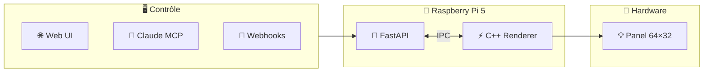

# 🎮 Super Pixeled

> Panneau LED RGB programmable 100% open-source et hackable

[](https://github.com/ThibautMelen/super-pixeled/actions)
[](LICENSE)
[](https://www.python.org/)
[](https://isocpp.org/)

---

## ✨ Features

- 🔥 **Effets temps réel** — Fire, Matrix, Waves, Plasma
- 🐍 **API REST + WebSocket** — FastAPI async
- ⚡ **Renderer C++ haute perf** — 60 FPS, Floyd dithering
- 🤖 **MCP Server** — Contrôle via Claude Code
- 🏠 **Intégrations** — Home Assistant, MQTT, Webhooks

---

## 🏗️ Architecture



---

## 📁 Structure

```
super-pixeled/
├── 00-docs/        # 📚 Documentation
├── 10-firmware/    # ⚡ C++ Renderer
├── 20-server/      # 🐍 Python API
├── 30-mcp/         # 🤖 MCP Server
└── 40-web/         # 🌐 Dashboard
```

---

## 🚀 Quick Start

### Prérequis

- Raspberry Pi 5 (8GB recommandé)
- Panneau LED HUB75 (Waveshare P2.5 64×32)
- Python 3.11+ & CMake 3.20+

### Installation

```bash
# Clone
git clone --recursive https://github.com/ThibautMelen/super-pixeled.git
cd super-pixeled

# C++ Renderer
cd 10-firmware
cmake -B build && cmake --build build

# Python Server
cd ../20-server
uv sync
uv run uvicorn app.main:app --host 0.0.0.0

# Web UI
open http://raspberrypi.local:8000
```

---

## 🧪 Tests

```bash
# Python
cd 20-server && uv run pytest --cov

# C++
cd 10-firmware && ctest --test-dir build

# Tous les hooks
pre-commit run --all-files
```

---

## 🎨 Effets Disponibles

| Effet | Description | Priorité |
|:------|:------------|:--------:|
| `fire` | Flammes réalistes | 🔴 P1 |
| `matrix` | Code tombant | 🔴 P1 |
| `waves` | Vagues RGB | 🔴 P1 |
| `plasma` | Sinus psychédélique | 🟡 P2 |
| `clock` | Horloge digitale | 🟡 P2 |

---

## 📡 API

```bash
# Afficher du texte
curl -X POST http://pi:8000/api/text \
  -H "Content-Type: application/json" \
  -d '{"text": "Hello!", "color": [255, 0, 0]}'

# Lancer un effet
curl -X POST http://pi:8000/api/effect \
  -d '{"name": "fire"}'
```

---

## 🤝 Contributing

1. Fork le repo
2. Crée ta branche (`git checkout -b feature/amazing`)
3. Commit (`git commit -m 'feat: add amazing feature'`)
4. Push (`git push origin feature/amazing`)
5. Ouvre une PR

---

## 📄 License

MIT © [Thibaut Melen](https://github.com/ThibautMelen)

---

<div align="center">

<sub>Built with Claude Code | Open-source LED panel project | 2025</sub><br/>
<sub>Powered by Raspberry Pi 5 + Waveshare HUB75</sub>

<br/>

<a href="https://github.com/ThibautMelen">
  
</a>
&nbsp;❤️&nbsp;
<a href="https://github.com/SuperNovae-studio">
  
</a>
&nbsp;🏴‍☠️

</div>
